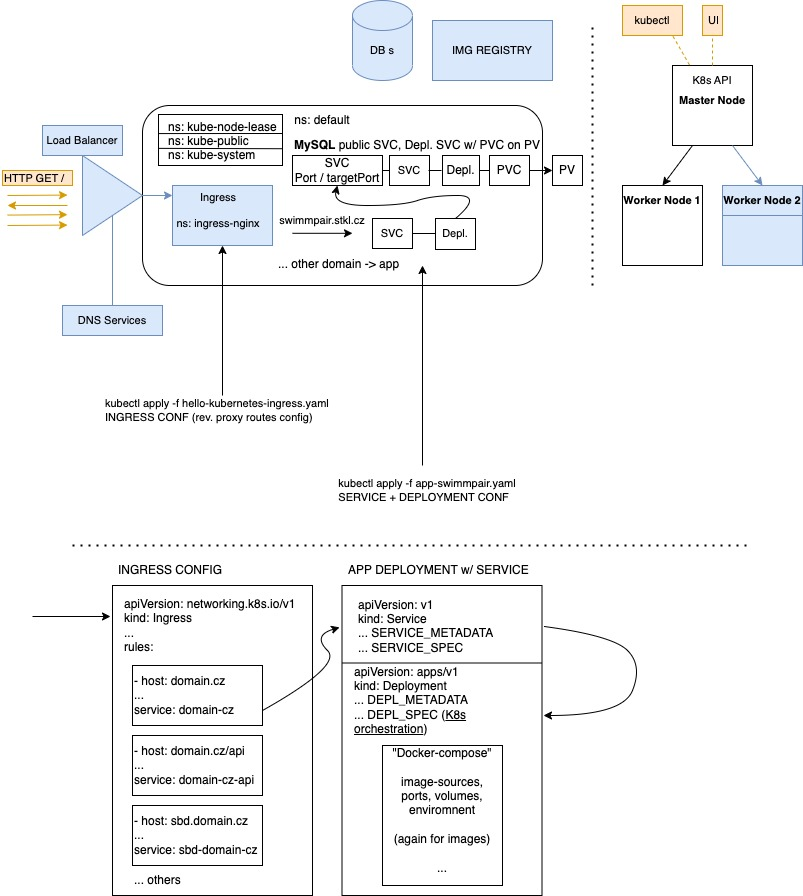

# DigitalOcean Kubernetes production Cluster
Description of DOKS setup and tools/applications w/ its configurations.
## Setup Overview 
We use DigitalOcean Managed Kubernetes in Amsterdam (Datacenter 3/AMS3). The setup is following:
- Kubernetes Cluster w/ **2 Node** workers **s-1vcpu-2gb-intel**, 
- **DigitalOcean Load Balancer** for accepting traffic - incoming HTTP requests,
- **Ingress Controller** w/ nginx in for routing traffic within Cluster into Kubernetes Services.  

We use [**Kubernetes Dashboard**](https://github.com/kubernetes/dashboard), [**Lens**](https://k8slens.dev/desktop.html) (via kubectl) and [**kubectl**](https://kubernetes.io/docs/tasks/tools/) for monitoring and adminsitration. Majority of application administration is performed by applying config files in following manner 
`kubectl apply -f kubernetes-ingress-config.yaml`. Overview is carried on either in GUI or by querying via **kubectl**, such as `kubectl get nodes`, `kubectl get deployments` or `kubectl describe ingress hello-kubernetes-ingress`.
## Cluster Visialization
1. Cluster Visualization - blue components are either external (DNS Services, Load Balancer / DBs or Image Registry) or added to the cloud later (Ingress). It shows architecture of MySQL DBs in cluster and one PHP app utilizing it. Orange color is used for external communication/traffic.
2. Cluster Running architecture - 1 DOKS (Master) & 2 Nodes (2nd+ nodes are optional - therefore blue).
3. YAML config files example mockup.

## Tools running in Kubernetes Cluster
- **kubernetes-ingress-config.yaml** - Ingress routes config.
- **mysql-deployment/** - MySQL Database in Kubernetes Cluster.
    - **0-encode-base64.sh** - Prepare base64 encoded root passwd. 
    - **0-mysql-secret.yaml** - Apply MySQL secret onto cluster.
    - **1-pv-pvc-mysql.yaml** - Create PV and get PVC (**Persistent Volume** and subsequent **Persistent Volume Claim** on it).
    - **2-deployment-mysql.yaml** - Deployment of MySQL utilising PVC as volume and mounted **/var/lib/mysql** on it.
    - **3-service-mysql.yaml** - Expose as a Service **mysql-service**.
- **adminer** - Adminer GUI client for browsing DBs running on **mysql-service** (expose from mysql-deployment pt.3).    
## Apps running in Kubernetes Cluster
- **app-lnmap.yaml** - Lightning Network map w/ Firebase BE (nginx image).
- **app-ubyvapuda-cz.yaml** - UbyvaPuda.cz static website tata (nginx image).
- **app-vipsidla-cz.yaml** - VIPSidla.cz static website Standa (php/apache image).
- ~~**app-hello-kubernetes-first.yaml** - Dummy application 1.~~
- ~~**app-hello-kubernetes-second.yaml** - Dummy application 2.~~
- (**app-swimmpair090.yaml** - **Legacy** pre-refactor SwimmPair at swimmpair090.stkl.cz)
- (**app-swimmpair-dev.yaml** - **Dev.** rolling SwimmPair at swimmpair.stkl.cz)
- **app-swimmpair-prod.yaml** - **Production** SwimmPair (sharply versioned after dev test) live for TJ Prostejov.
- **docu-swimmpair.yaml** - Doxygen documentation for SwimmPair API model, hosted on URL http://docu.swimmpair.cz

